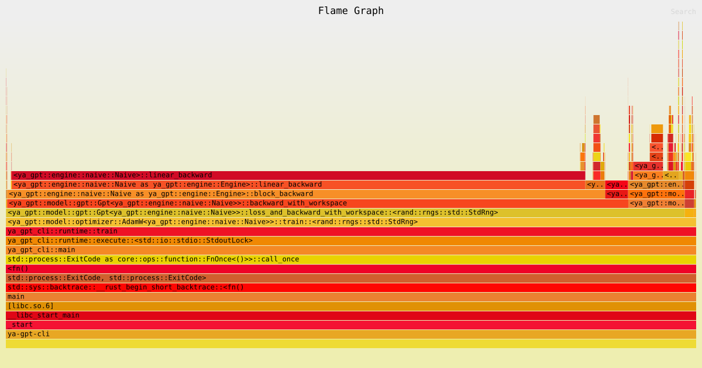

# Yet Another GPT

Yet another GPT implementation in pure Rust, with minimal dependencies and no ML frameworks.

The main goal is to experiment with and compare the performance of different engine implementations. The model uses only self-attention; cross-attention is intentionally omitted to keep the implementation as simple as possible. Supports training and text generation through a naive CPU, SIMD backend, and CUDA. We also use a char-stream fixed tokenizer to reduce the training workload.

This work is based on the foundational Transformer architecture introduced by [Vaswani et al. (2017)](https://arxiv.org/abs/1706.03762), and specifically builds on the decoder-only structure of the early GPT implementations pioneered by [Radford et al. (2018)](https://cdn.openai.com/research-covers/language-unsupervised/language_understanding_paper.pdf).

This is *NOT* intended for production use.

### Models

A model will start to perform reasonably with ~1.88 loss (cross-entropy). Any value greater than that will yield gibberish text for our Shakespeare input. If you don't have a GPU, you can achieve a fairly decent result (~1.6 loss) with a SIMD backend.

```
# RTX 4500 ADA
$ time just train-cuda 0 large 10000
..
step 10000: train loss 0.8152, val loss 1.5977
just train-cuda 0 large 10000  2166.29s user 592.70s system 99% cpu 46:11.70 total
```

```
$ cargo run -- inspect --pretty --input ./assets/model-shakespeare-large-10000.bin
{
  "name": "ya-gpt",
  "authors": "Victor Lopez <vhrlopes@gmail.com>",
  "major": "0",
  "fp": "f32",
  "params": 4833858,
  "train_loss": 0.81526476,
  "validation_loss": 1.5977424
}
```

```
$ just generate-cuda 0 250 ./assets/model-shakespeare-large-10000.bin "ROMEO:"
ROMEO:
O, every son, of all things loyal renown'd
With uprights trouble mine.
As I am confidence!

BENVOLIO:
Stay, your name is Catesby Peruchio,
For the wrath that were laid more than they will not have;
For there is a great sorrow to your confirmmand.
```

```
$ just generate-cuda 0 250 ./assets/model-poe-poem-large-10000.bin "Once upon"
Once upon the atmosphere.

  Roman idolation was utterly natural. Charmion; doubtless,
  born riven one that he would have been looked upon it,
  _I_ was greatly within my desire, and, above half the envy of awakes blue and
  vague unquisition, and conve
```

### Planned features

- May introduce a miniBPE tokenizer. The goal of this repo is to be able to train models with a consumer grade GPU, but the self-attention quadratic sequence length fallout is a problem for char-stream tokenizers. miniBPE (1k-2k tokens vs 50k of standard BPE) will still be doable on a good desktop GPU (~12VRAM), but need to check the time to complete the train.

### Profiling

Below is a flamegraph for preset small with 100 interactions, using the Naive backend (better readability):


